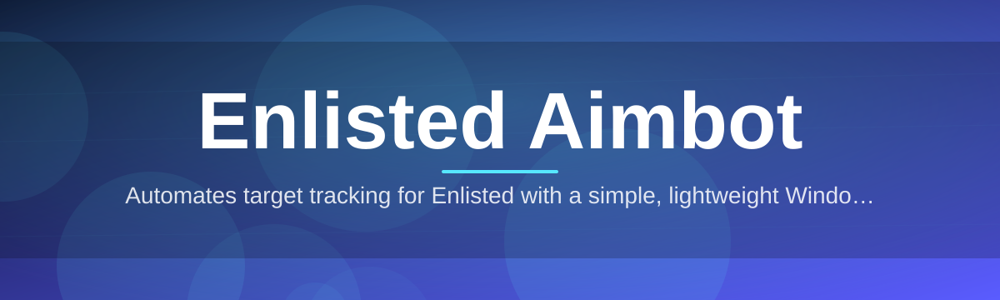
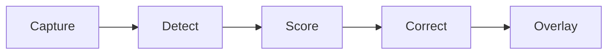

# enlisted-aim-assistant 🎯🛡️

  

*Precision assistance for Enlisted, tuned for the way trench warfare actually plays out.*

  

## 🧭 Overview

Enlisted rewards patience and mechanical precision, but the gap between "I saw the enemy" and "I hit the enemy" is where most engagements are decided — often within a fraction of a second, across ballistic drop, bolt-action delay, and moving targets at odd angles. **enlisted-aim-assistant** exists to narrow that gap without turning the game into something unrecognizable. It's built as a companion overlay that reads visual cues and helps steady your aim, so the skill ceiling shifts from "can you flick fast enough" to "can you position and think faster."

This project sits at the intersection of computer vision and low-latency input handling. It was designed for players who want consistency across long sessions — squad leaders holding a lane, snipers working elevation changes, and tankers tracking fast infantry at close range. Rather than acting as a black box, the assistant exposes every tunable parameter so you understand exactly what it's doing and why, session after session.

Enlisted Aimbot, as a category of tool, has existed in various rough forms for years. This iteration focuses on stability and clarity: fewer moving parts, a calmer interface, and a codebase that doesn't fight you when you want to adjust it. It is a Windows-only, standalone assistant — no background services, no bloated dependency chain, just a single application that starts when you need it and disappears when you don't.

---

## ⚙️ What It Actually Does

The table below walks through the core capabilities — each one solves a distinct problem players run into during live matches.

| Capability | What It Solves |
|---|---|
| **Adaptive Target Lock** — tracks the nearest valid silhouette within your configured field-of-view radius | Eliminates the micro-drift that happens when a target changes direction mid-swing |
| **Ballistic Drop Compensation** — adjusts vertical offset based on estimated range | Removes the guesswork of arcing shots at medium-to-long distance |
| **Recoil-Aware Smoothing** — dampens correction curves so movement stays human-shaped | Keeps aim assistance from looking robotic or triggering suspicion in spectator mode |
| **Per-Weapon Profiles** — separate sensitivity and smoothing curves for bolt-actions, semi-autos, and MGs | One config almost never fits every class you play |
| **Overlay HUD** — lightweight on-screen indicator showing lock state and confidence | Tells you at a glance whether the assistant is actually engaged |
| **Hotkey Toggle Layer** — instant on/off without touching the mouse | Lets you disable assistance the moment you're in a casual or spectated match |
| **Session Logging** — records activation frequency and lock duration | Useful for reviewing how much the tool actually influenced a match |
| **Low-Latency Capture Pipeline** — screen-reads at high frequency with minimal frame delay | Prevents the "sticky, laggy" feel that ruins fast-paced firefights |

> [!TIP]
> Start every new weapon profile with smoothing set higher than you think you need. Enlisted's bullet travel time punishes over-corrected snaps far more than it punishes a slightly slower lock.

---

## 🚀 Getting Started

> [!NOTE]
> No package managers, no manual dependency installs. This is a standalone Windows executable by design.

1. Visit the landing page via the download button above or below.

2. Download the latest packaged build for 2026.

3. Run the application — Windows may show a SmartScreen prompt on first launch; this is expected for unsigned indie tooling.

4. Launch Enlisted, tab back into the assistant overlay, select a weapon profile, and toggle the hotkey layer on.

---

## 🖥️ System Requirements

| Component | Minimum |
|---|---|
| **OS** | Windows 10 (64-bit) or Windows 11 |
| **CPU** | Quad-core, 3.0GHz+ recommended for stable capture rate |
| **GPU** | Any GPU capable of running Enlisted at 60+ FPS |
| **RAM** | 4GB free |
| **Dependencies** | None — fully standalone |
| **Display** | 1080p or higher, single or multi-monitor |

---

## 🧩 How It Works

The assistant operates as a closed loop: capture, interpret, correct, repeat. Nothing is stored server-side, and nothing leaves your machine.

1. **Frame Capture** — a lightweight screen-reader samples the active game region at high frequency.
2. **Silhouette Detection** — the frame is analyzed for enemy shapes against terrain and foliage noise.
3. **Confidence Scoring** — each detected silhouette gets a lock-confidence value based on clarity and movement.
4. **Correction Application** — if confidence clears your threshold, a smoothed cursor correction is applied.
5. **Overlay Feedback** — the HUD reflects the current lock state so you always know what's happening.

> [!IMPORTANT]
> Detection quality depends heavily on in-game visual settings. Overly aggressive foliage density or motion blur will reduce lock confidence — adjust your graphics settings for best results.

---

## 🛟 Troubleshooting

<strong>The overlay shows "No Signal" even though the game is running.</strong>

The capture pipeline may be pointed at the wrong window. Reselect the Enlisted process from the target dropdown in Settings, and make sure the game is running in Borderless Windowed rather than exclusive Fullscreen.

<strong>Aim correction feels jittery or overshoots targets.</strong>

Lower the smoothing aggressiveness in your active weapon profile. High-RPM weapons need gentler correction curves than bolt-actions.

<strong>Windows SmartScreen is blocking the executable.</strong>

This is standard behavior for unsigned independent tools. Click "More info" and then "Run anyway" from the SmartScreen dialog.

<strong>The hotkey toggle isn't responding.</strong>

Another application may be capturing the same key binding. Change the toggle key in Settings > Hotkeys to something unused, such as a numpad key.

<strong>Performance drops during large-scale battles.</strong>

Reduce the capture region size in Settings — a tighter crosshair-centered region lowers processing load significantly during 30v30 engagements.

> [!WARNING]
> Running multiple overlay tools simultaneously (this one plus a separate FPS counter or recording overlay) can cause capture conflicts. Close redundant overlays for the most stable experience.

---

## 🎨 UI / UX Details

The interface favors clarity over decoration — a dark, low-glare panel that won't compete with what's happening on screen.

- **Keyboard Shortcuts**
  - `Insert` — toggle assistant on/off
  - `F5` — cycle weapon profiles
  - `F6` — open quick-settings overlay
  - `F9` — reset current profile to defaults

- **Themes** — Slate Dark (default), High Contrast, and a minimal Outline mode for competitive clarity.

- **Settings Persistence** — all profile and hotkey configurations save automatically between sessions.

> [!NOTE]
> The overlay is click-through by default, so it never intercepts your mouse input during gameplay.

---

## 🤝 Contributing & Community

Contributions are welcome, whether that's refining the detection heuristics, improving smoothing curves, or simply reporting how the assistant behaves on different maps and weapon classes.

> Open an issue with your Enlisted build version, weapon profile, and a short description of the behavior — this speeds up triage considerably.

Discussions around ballistic modeling, per-map tuning presets, and UI refinements are especially valuable given how varied Enlisted's terrain and engagement ranges are.

---

## 📜 License

Released under the [MIT License](LICENSE), 2026.

---

## ⚠️ Disclaimer

This project is provided for educational and personal-use purposes related to studying real-time computer vision and input-assistance techniques. Use of aim-assistance tooling may violate the terms of service of Enlisted or its publisher. Users assume full responsibility for how this software is used, and the maintainers accept no liability for account actions, bans, or other consequences resulting from its use.

